### pom.xml 파일에 추가한 Junit5 의존성
  - 스프링부트 프로젝트를 생성하였기 때문에 별도의 의존성을 추가하지 않는다.
  - spring-boot-starter-test 하위에 책에서 요구하는 api와 engine을 포함하는 것을 확인 할 수 있다.
  

### @TestInstance(Lifecycle.PER_CLASS)
  - 테스트는 실행 순서에 관계없이 동일한 결과를 얻어야 하므로, @Test 메서드를 호출하기 전에 테스트 클래스 인스턴스를 매번 새로 만든다.
  - 따라서 테스트 메서드 간에 인스턴스 변수를 재사용할 수 없다.
  - **@TestInstance(Lifecycle.PER_CLASS)**
    - 테스트 클래스 인스턴스가 메서드 단위가 아닌 클래스 단위로 생성 된다.

### @Tag
  - JUnit 4 category를 대체한다.
  - 테스트 클래스와 테스트 메서드에 `@Tag`  어노테이션을 사용할 수 있다.
  - 태그를 사용하면 테스트를 발견하거나 실행할 때 필터를 적용할 수 있다.

   
  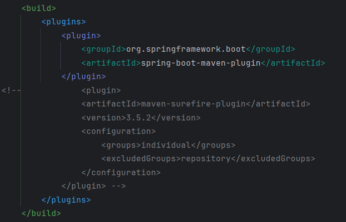
  
  - 위 상태로 빌드를 진행하면 아래와 같은 결과가 나온다. (모든 테스트를 진행함)
    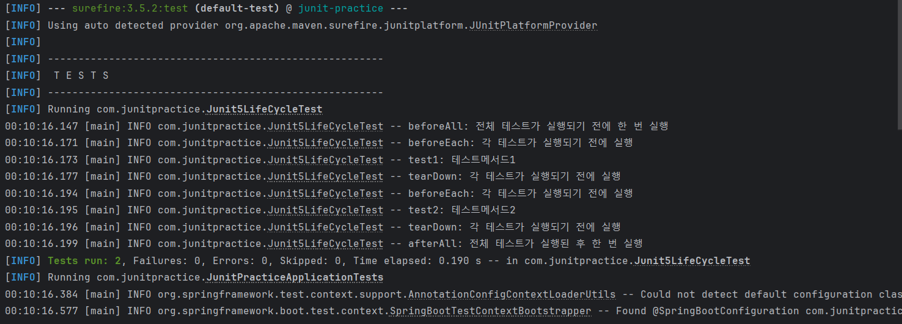
    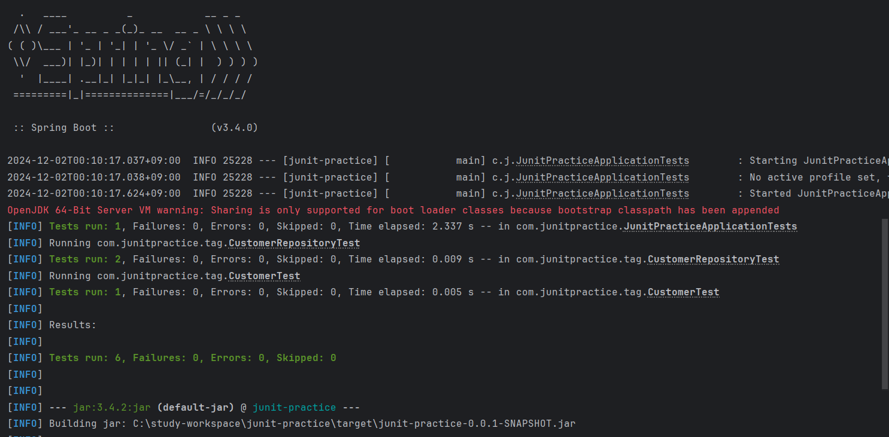
        
  - 위 주석을 제거하고 빌드를 진행하면 아래와 같은 결과가 나온다. (지정 그룹, 제외 그룹을 필터링 하여 테스트를 진행함)
    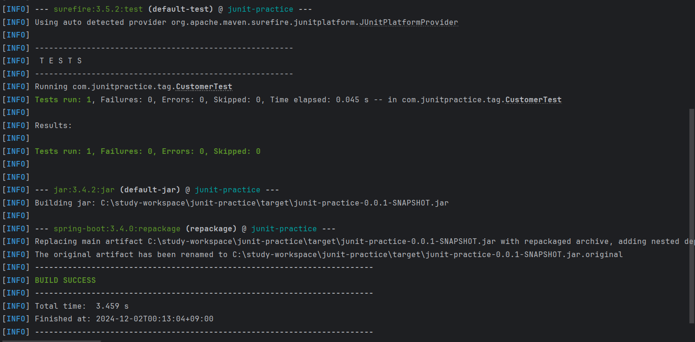

## 단언문

### Assertions

- JUnit 5는 과거 Hamcrest 매처와 함께 사용했던 assertThat 메서드를 더 지원하지 않는다.
- Hamcrest의 MatcherAssert.assertThat을 오버로딩한 메서드를 사용하는 것을 권장한다.

  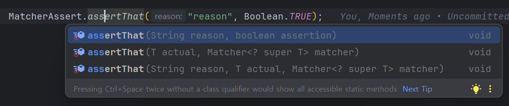

- **assertAll**

  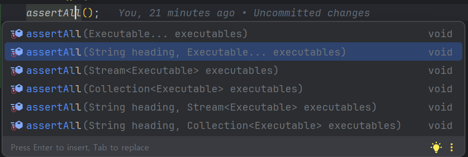

    - heading
        - assertAll 메서드 내에서 단언문이 어떤 일을 하는지 알려준다.

- **Supplier<String> messageSuplier**
    - 테스트가 실패하면  지정한 오류 메세지를 지연 전달한다.

- 단언문에서 람다식을 파라미터로 사용할 떄의 이점은 **지연 전달** 덕분에 성능이 향상되는 데 있다.

### assertTimeout, assertTimeoutPreemptively

- JUnit 4 Timeout rule을 대체 한다.

- **assertTimeout**

  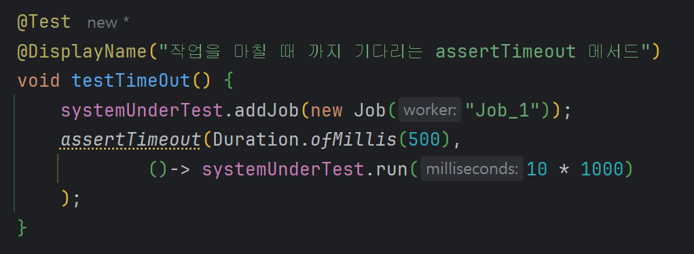

  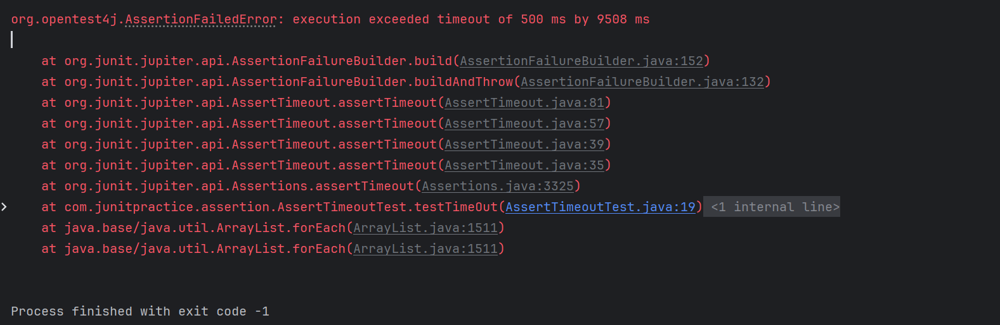

  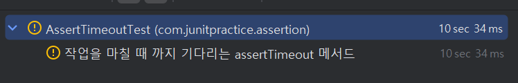

    - 테스트가 주어진 시간을 초과하면 테스트가 얼마나 늦어졌는지 알려준다.

- - **assertTimeoutPreemptively**
- pre-emptive는 사전적으로 1.선제의, 예방의, 우선권이 있는 이라는 뜻이다.

  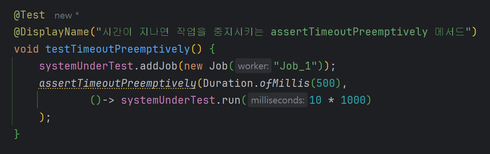

  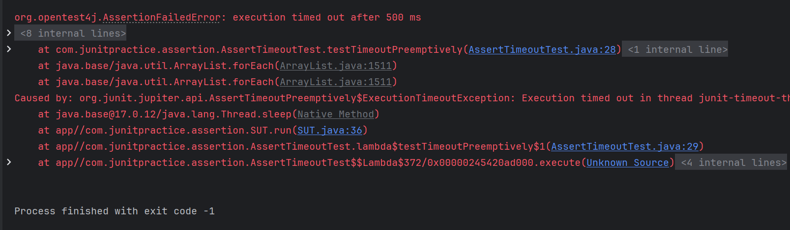

  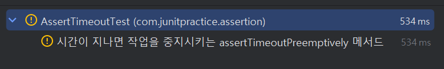

    - 시간이 지나면 executable 객체를 중지시킨다.